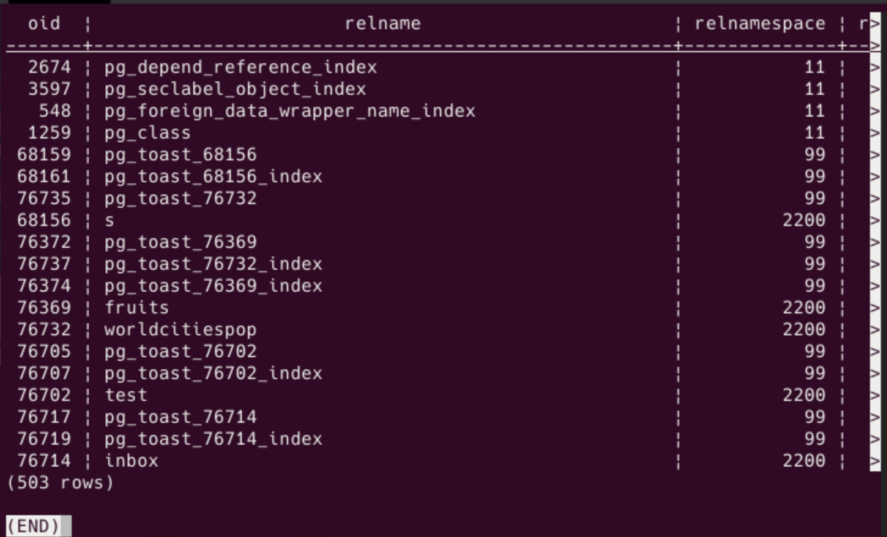
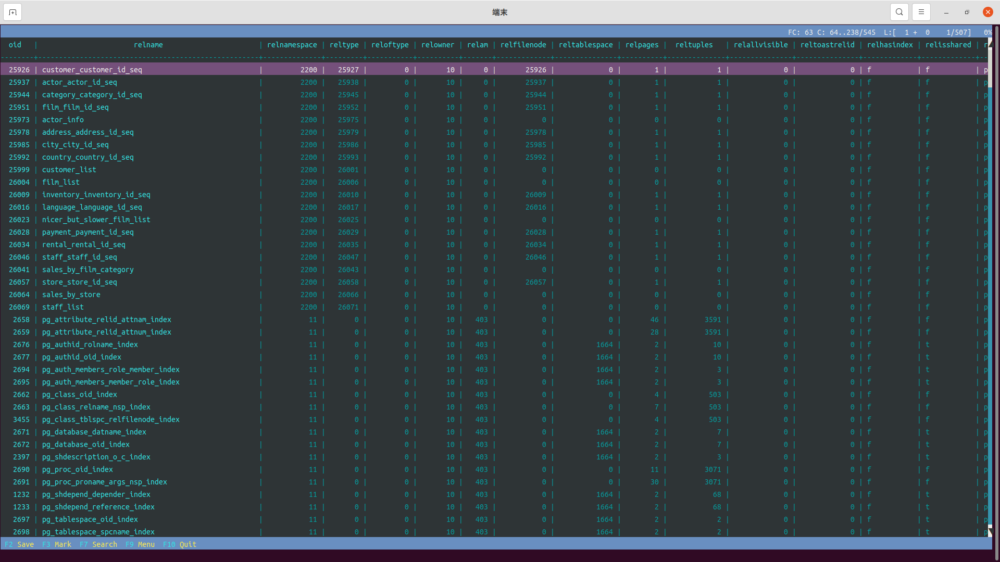
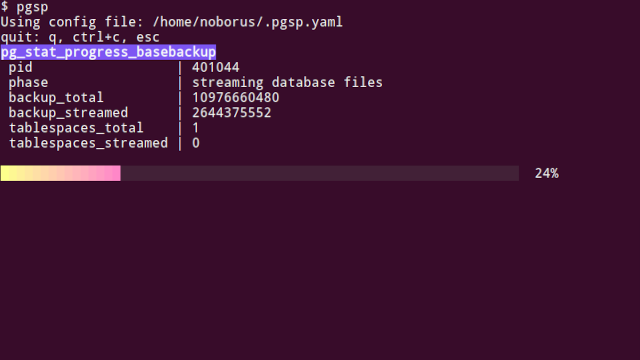
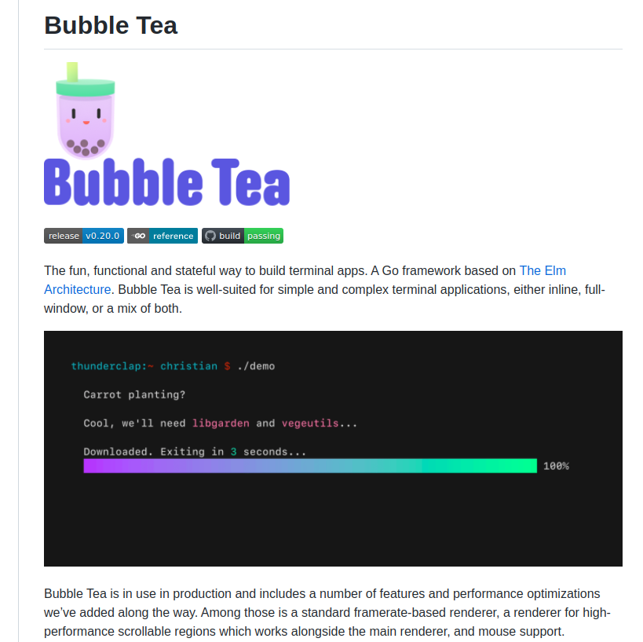
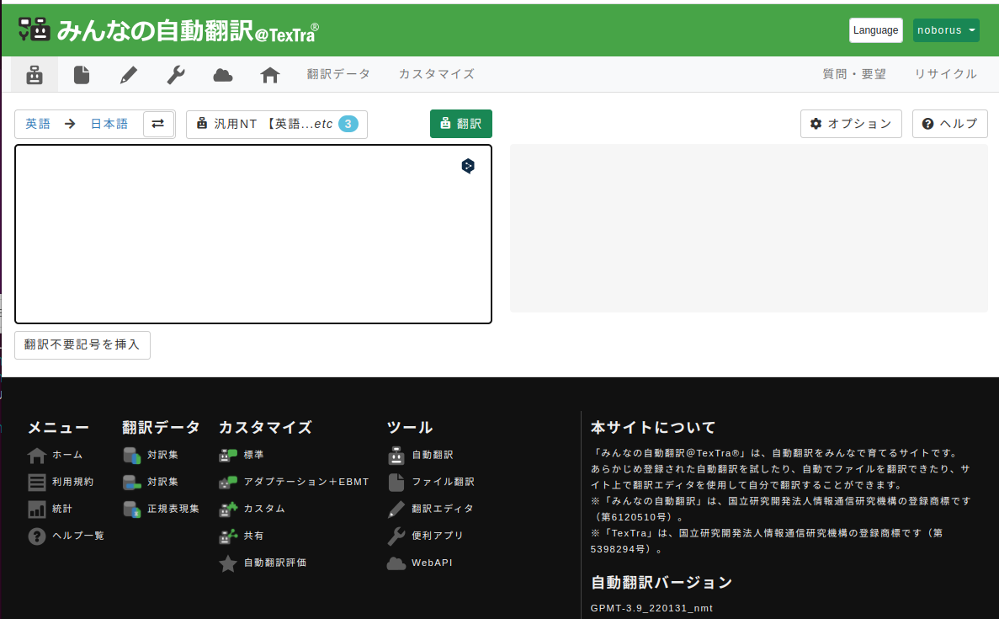

# <!-- fit -->作ったツールの紹介

[https://github.com/noborus](https://github.com/noborus)

斉藤　登

---

## PostgreSQLに関連した以下のツールを紹介します

* **trdsql**
  テキストとデータのツール
* **ov**
  ターミナルページャー
* **pgsp**
  pg_stat_progress監視ツール
* **jpug-doc-tool**
  マニュアル翻訳ツール

全部Goで書かれたCLIツールです。

---
<!-- footer: trdsql -->

## trdsql

<style scoped>
    section { 
        font-size: 300%;
    }
</style>

PostgreSQLユーザーにこそ使ってほしいtrdsql

[https://github.com/noborus/trdsql](https://github.com/noborus/trdsql)

---

### trdsqlとは？

CSV,LTSV,JSON等にSQLを実行できるツール

```console
trdsql -ih "SELECT id, name, price FROM fruits.csv" 
```

```csv
1,apple,100
2,orange,50
3,melon,500
```

同様のツールはいくつか存在する `q`, `textql`...

trdsqlはDBエンジンを変更できる！

---

### trdsqlはPostgreSQLに接続可能

類似ツールの多くは内部でSQLite3を使用している。

trdsqlもSQLite3を（内蔵して）使用しているが、PostgreSQL,MySQLに変更可能。

`-driver`オプションと接続先を表す`-dsn`オプションで変更可能。

```console
trdsql -driver postgres -dsn "host='/var/run/postgresql/'" "SELECT * FROM fruits.csv"
```

（設定ファイルにも書けます）。

PostgreSQLのSQL構文、SQL関数が使えるのでストレスフリー

---

### PostgreSQLのインポート、エクスポート

trdsqlはファイルにSQLを実行するだけでなく、もっと使いみちがある。

ファイルのJOINだけでなく、ファイルとテーブルのJOINも可能。

テーブルだけに対しても実行可能で、SELECT以外のSQLを実行しても問題ありません。

そのため、インポート、エクスポートもできます。

---

#### エクスポート

既存のテーブルにSQLを実行。

```console
trdsql -driver postgres -dsn "host='/var/run/postgresql/'" -omd "SELECT * FROM actor"
```

| actor_id | first_name |  last_name   |     last_update      |
|----------|------------|--------------|----------------------|
|        1 | Penelope   | Guiness      | 2013-05-26T14:47:57Z |
|        2 | Nick       | Wahlberg     | 2013-05-26T14:47:57Z |
|        3 | Ed         | Chase        | 2013-05-26T14:47:57Z |
|        4 | Jennifer   | Davis        | 2013-05-26T14:47:57Z |
|        5 | Johnny     | Lollobrigida | 2013-05-26T14:47:57Z |

---

### インポート

trdsqlの動作として、元々ファイルを指定した場合にテンポラリテーブルを作成して、インポートしている。

そのため、テンポラリテーブルではなく実テーブルを指定する機能を開発しようとするが、考慮することが爆発的に増える。

* テーブルがすでに存在している場合…
* 列名を変えたい…
* 型を定義したい…

機能開発は中止。

---

SQLで実行すればよいことに気づいた。

```console
trdsql "CREATE TABLE fruits AS SELECT id::int,name,price::int FROM fruits.csv"
```

`CREATEE TABLE テーブル AS`の代わりに`INSERT INTO テーブル SELECT`を使用すれば既存のテーブルにもインポート可能。

`ON CONFLICT DO NOTHING`や`ON CONFLICT DO UPDATE`を使用すれば、専用のインポートツールよりも柔軟なインポートが可能。

---

#### JSON対応

trdsqlはJSONL(NDJSON）やトップが配列になっているJSONが対象だった。
ただ、そこから外れるけど、リスト形式なJSONはよくある。


```json
{
    "userList": [
        {
            "userID": 1,
            "nickname": "taro",
        },
        {
            "userID": 2,
            "nickname": "hanoko",
        },
        {
            "userID": 3,
            "nickname": "momoko",
        }
    ]
}
```

---

そのままだとusrListという1列1行のテーブルになる。

```console
trdsql -omd "SELECT * FROM sample.json"
```

```at
|                                              userList                                              |
|----------------------------------------------------------------------------------------------------|
| [{"nickname":"taro","userID":1},{"nickname":"hanoko","userID":2},{"nickname":"momoko","userID":3}] |
```

前まではSQLのJSON関数でなんとかするか、jqで前処理をしてパイプで渡せば良いと考えていた。

```console
jq ".userList" sample.json | trdsql -omd -ijson "SELECT * FROM -"
```

---

#### jq構文

`gojq`というGo製のjqクローンが開発されていた。
packageとして使えるので、取り込んでしまった方が便利。

ファイル名`::`の後にjq構文を書くと解釈してからSQLを実行できるようにした。

```console
trdsql -omd "SELECT * FROM sample.json::.userList"
```

| userID | nickname |
|--------|----------|
|      1 | taro     |
|      2 | hanoko   |
|      3 | momoko   |

---
<!-- footer: ov -->

<style scoped>
    section {
        font-size: 300%;
    }
</style>

⇒ 次のツール

### PostgreSQLの開発当初からあった問題が 2021年に進展したのをご存知でしょうか？

それは…

---

<style scoped>
    section {
        font-size: 300%;
    }
</style>

### lessにヘッダーオプションが入った！

（まだベータリリース版）

```console
less --header 2
```

---

### Pager

lessはPagerと呼ばれるジャンルのアプリケーションで、
画面に収まらない出力を1画面ずつ表示。

Pagerはいくつかある。more,less,most...

psqlやmysqlのREPLは自分でパイプに渡せないので内部で使用する。
環境変数PAGERで設定されたコマンドを使用する。

Pagerに渡った後はPagerの操作になるので、
psqlを使っていると思っている半分はPagerを操作している。

**psqlにってPagerは大事**

---

### less

http://greenwoodsoftware.com/less/

Pagerのデファクトスタンダードといえる存在がless

いつの間にかGitHubにも置かれていてissue対応してます！
https://github.com/gwsw/less

1983年からの開発で2021年にヘッダーオプションが入った。

それまでは最初に列名を出力してもスクロールすると消えていた。
psqlの出力が画面に収まらないと '\x'で縦に表示しろというのが定番でした。

---

ヘッダーオプションを使用することで、常に列名が表示できるようになった。



（ヘッダーオプションを使用すると折り返さず横スクロール表示になる）。

---

### pspg

[pspg](https://github.com/okbob/pspg) はテーブル表示に特化したページャー。
pspgを使用することで、列名を常に表示、列の固定を利用して閲覧できる。
テーブル表示なので、画面端でも折り返さないで横スクロールして表示する。



`pspg`はpsqlを想定して作られているので、psqlを使用するならpspgの方が便利。

---

## ov

[https://github.com/noborus/ov](https://github.com/noborus/ov)

私が新しく作った汎用ページャー。

1つの表示方法だけでなく、いろんな表示を動的に切り替えられる。

ヘッダー表示しても折返しができるようにした。
画面幅に収まらなくても横スクロールしないで表示できる。

そのために以下の機能を追加。

* 行背景の交互表示
* 列のハイライト

---

### ovは機能盛りだくさん

* 検索 - インクリメンタルサーチ、正規表現のインクリメンタルサーチ
* フォローモード（tail -f相当）、複数ファイルのフォローモード
* 圧縮ファイル対応（gzip,bzip2,zstd,lz4,xz）
* execモード（標準出力と標準エラー出力を分けて表示）

---

### 開発予定

#### PSQL_WATCH_PAGER

開発中のPostgreSQL 15ではPSQL_WATCH_PAGERという環境変数が追加される予定。
この変数をセットすれば`\watch`の出力をPAGERに出力できる。
pspgが対応（pspgの作者が入れた）
--streamオプションを使う。

`\watch`の出力はスクロールして流れていくので複数行出力しての変化は見づらい。
先頭からの位置が変わらないと変化に気づきやすい。
Unixコマンドで言えばpsコマンドを定期的に実行するか、topコマンドを使用するかの違い。

---

実際に`\watch`を実行した結果がPAGERに渡されると以下のような形式で出力される。

```
Thu Mar 17 15:53:27 2022 (every 1s)   <------ タイトル
                                      <!----- 空行
 a | b 
---+---
 1 | 2
(1 row)
                                       <!----- 空行（次の行は1秒後に出力）
Thu Mar 17 15:53:28 2022 (every 1s)    <------ タイトル
                                       <!----- 空行
 a | b 
---+---
 1 | 2
(1 row)
                                       <!----- 空行
```

---

* 1回目の空行でタイトルが終わって結果がはじまりを表す
* 2回目の空行で結果の終わりを表す

この結果に依存して表示モードを作るのは辛い…
空行が途中で入ったり、空行を取りこぼしたりするとズレて表示が崩れやすい。

結果の区切り文字を^L(form feed)追加することを提案して、CommitFestにも登録した。

pspg作者のPavel Stehuleさんだけ賛成してくれたけど、他の反応はイマイチ…
ovで\watchが使いやすく表示できるのかは不透明。

---
<!-- footer: pgsp -->

<style scoped>
    section { 
        font-size: 300%;
    }
</style>

⇒ 次のツール

## pgsp

https://github.com/noborus/pgsp



---

pg_stat_progess_* という、処理中状況を表すViewを表示するだけの
シンプルなツール

### 対象View

バージョンによって増えていきますが。以下のViewを対象にしています。

* pg_stat_progress_analyze
* pg_stat_progress_basebackup
* pg_stat_progress_cluster
* pg_stat_progress_copy
* pg_stat_progress_create_index
* pg_stat_progress_vacuum

---

```SQL
SELECT * FROM pg_stat_progress_analyze;
```

実行すれば、その時点での状況を教えてくれる。

```
  pid  | datid | datname | relid |         phase         | sample_blks_total |  
   sample_blks_scanned | ext_stats_total | ext_stats_computed | child_tables_total |
    child_tables_done | current_child_table_relid 
-------+-------+---------+-------+-----------------------+------------------
-+---------------------+-----------------+--------------------+-------------------
-+-------------------+---------------------------
 30481 | 16386 | noborus | 25855 | acquiring sample rows |             30000
  |               21320 |               0 |                  0 |                  0
   |                 0 |                         0 
(1 row)
```

（結果はViewによって異なる。）

---

### 問題点

処理中にはレコードが追加されて、処理が終わるとレコードが消える。

`psql`の`\watch`を使用すれば監視できるが、
前述の通り`\watch`はスクロールして流れていくので変化は見づらい。

前述のPSQL_WATCH_PAGERによって改善するかもしれない。

そもそも、わかりやすくない。

---

### pgsp

プログレスのViewなんだからプログレスバーを表示する監視ツールを探す
が無かった⇒そこで作ったのが`pgsp`

#### 特徴

* 1つのviewだけでなく、複数のview（デフォルトは全部）に対して定期的に問い合わせる。
* 処理中はわかる範囲でプログレスバーを表示。
* レコードが消えても指定した秒数間は表示し続ける。
* ターミナルの表示域（幅、高さ）によって、表示方法を変更。
* オプションで、監視間隔、終了してから表示し続ける秒数等に対応。

---

### 今後



GoのTUIフレームワークBubble Teaを使用

https://github.com/charmbracelet/bubbletea

プログレスバー以外にも機能豊富なので、統合監視ツールも作れるかも。

---
<!-- footer: jpug-doc-tool -->

<style scoped>
    section { 
        font-size: 300%;
    }
</style>

⇒ 次のツール

## jpug-doc-tool

PostgreSQLマニュアル翻訳のためのツール

https://github.com/noborus/jpug-doc-tool/

---

### 自己紹介

PostgreSQLマニュアルの日本語翻訳プロジェクトに参加している斉藤です。

PostgreSQLマニュアルの日本語翻訳の管理がGitHubに移行してからビルドツールの修正等以下のことを担当しています。

* UTF-8への変更
* ビルド環境の修正
* CIの整備
* CSS、HTMLのヘッダーフッター
* PDF作成
* https://pgsql-jp.github.io/ の管理

翻訳もやってますが、英語は得意じゃないです。

---

### PostgreSQL日本語マニュアル

PostgreSQL日本語マニュアル翻訳プロジェクトはjpug-docという名前で管理されています。

[https://github.com/pgsql-jp/jpug-doc](https://github.com/pgsql-jp/jpug-doc)

詳しくはQiitaの[PostgreSQL日本語マニュアルについて](https://qiita.com/noborus/items/03f98e43c216d7e23767)を参照してください。

現在、拡張子はsgmlですが、すべてXML処理系で処理されています。

---

<style scoped>
    section { 
        font-size: 130%;
    }
</style>

### jpug-doc-tool誕生のきっかけ

PostgreSQL 13のマニュアルには「翻訳が終わらない危機」があった。
中身は変わらないが表記法が変わって変更量が爆発した。

一番影響が大きかったfunc.sgml。

| バージョンアップ | 変更行数 |
|:-----------|----------:|
| 11.0⇒12.0    |    2,168 |
| 12.0⇒13.0    |   36,575 |

変更（+,-）の行数が実際の行数を上回った。

| バージョン | 行数 |
|:-----------|----------:|
| 12.0 | 22,673 |
| 13.0 | 21,153 |

---
<style scoped>
    section {
        font-size: 130%;
    }
</style>

### 実際の変更例

内容は変わらないが、タグが変わって、
13のマニュアルに対して12の翻訳をマージできず

```xml
<entry>round()</entry>
<entry>numeric</entry>
<!--
    <entry>Rounds to nearest integer</entry>
-->
    <entry>最も近い整数への丸め</entry>
```

を以下のようにする必要がある。

```xml
<entry>
    <para>round</para>
    <para>numeric</para>
    <para>
<!--
      Rounds to nearest integer
-->
最も近い整数への丸め
    </para>
</entry>
```

---

英語と日本語のペアのリストを抽出して、
新しいバージョンで日本語訳を挿入する方法にした。

```txt
en:Rounds to nearest integer
ja:最も近い整数への丸め
```

実装は正規表現バリバリ。
XML処理系で置き換えようとするとインデントが元に戻せなかった…

数パターンに対応したので、他の人に使えるように体裁を整えたのが
`jpug-doc-tool`

---

### jpug-doc-toolの機能

#### チェック機能を追加

英語と日本語のペアのリストにより以下のチェックが可能になった。

* 未翻訳の英語だけのパラグラフがないか
* 英語、日本語訳のタグが同じか
* 日本語に含まれている英単語が英語にもあるか
* 英語と日本語を指定して両方含まれているか `--en merge --ja マージ`
* 数値は同じ数値が含まれているか

13の翻訳完了後も数十カ所発見（最近http->https等の修正が多くあった）。

---

#### 日本語訳挿入の強化

完全一致した場合のみ日本語訳を適用するだけでなく、類似した文に注意書きを入れて挿入するオプションを追加。

`a SQL` ⇒ `an SQL` のような修正では日本語訳の修正は必要ない。

レーベンシュタイン距離によって同一ファイル内の文から類似しているか比較（package https://github.com/agnivade/levenshtein を使用しているだけ）。

**さらにAPIを利用した機械翻訳も！**

---
<style scoped>
    section { 
        font-size: 130%;
    }
</style>

### みんなの自動翻訳＠TexTra



https://mt-auto-minhon-mlt.ucri.jgn-x.jp/

利用規約にオープンソースライセンスの翻訳に使用できることが明言されている。

いわゆるAI翻訳で精度も日々向上している。

APIも公開している。
GoからAPIを利用できるパッケージを作成。

https://github.com/noborus/go-textra

jpug-doc-toolにも組み込んだ。

---

アカウント情報を設定ファイルに書いたら、以下を実行すると…

```console
jpug-doc-tool replace --mt brin.sgml
```

未翻訳の箇所に日本語訳を挿入する。

```
API...[Some of the built-in operator ] Done
API...[bloom operator classes accept ] Done
API...[Defines the estimated number o] Done
API...[Defines the desired false posi] Done
API...[minmax-multi operator classes ] Done
API...[Defines the maximum number of ] Done
API...[Returns whether all the ScanKe] Done
API...[To write an operator class for] Done
API...[Support procedure numbers 1-10] Done
API...[The minmax-multi operator clas] Done
replace: brin.sgml
```

---

### 「みんなの自動翻訳」を利用した日本語訳挿入

```diff
diff --git a/doc/src/sgml/brin.sgml b/doc/src/sgml/brin.sgml
index 7b90452dd8..0c60b2bc79 100644
--- a/doc/src/sgml/brin.sgml
+++ b/doc/src/sgml/brin.sgml
@@ -778,14 +778,24 @@ LOG:  request for BRIN range summarization for index "brin_wi_idx" page 128 was
    <title>Operator Class Parameters</title>
 
    <para>
+<!--
     Some of the built-in operator classes allow specifying parameters affecting
     behavior of the operator class.  Each operator class has its own set of
     allowed parameters.  Only the <literal>bloom</literal> and <literal>minmax-multi</literal>
     operator classes allow specifying parameters:
+-->
+<!-- 《機械翻訳》 -->
+一部の組み込み演算子クラスでは、演算子クラスの動作に影響するパラメータを指定できます。
+各演算子クラスには、使用可能なパラメータの独自のセットがあります。
+パラメータを指定できるのは、<literal>bloom</literal>演算子クラスと<literal>minmax-multi</literal>演算子クラスのみです。
    </para>
 ```

 最後に人がチェックして修正し、《機械翻訳》コメントを消せばOK。

---

### 「みんなの自動翻訳」をコマンドで利用

コマンドラインから翻訳ツールとしても使用できる。

```console
 jpug-doc-tool mt "This is a pen."
```

generalNT_en_jaがデフォルトの翻訳エンジンだが、カスタマイズした翻訳エンジンを追加できる。

```console
c-1640_en_ja: これはペンです。
generalNT_en_ja: これはペンです。
```

自動翻訳の利用は、まだほぼされていない。
jpug-doc-toolを利用している人が自分以外いない…

---

<style scoped>
    section { 
        font-size: 170%; 
    }
</style>


紹介したツール
（全部MITライセンスです）

**trdsql**
https://github.com/noborus/trdsql

**ov**
https://github.com/noborus/ov

**pgsp**
https://github.com/noborus/pgsp

**jpug-doc-tool**
https://github.com/noborus/jpug-doc-tool

みんなの自動翻訳APIクライアント
Goパッケージ
https://github.com/noborus/go-textra
